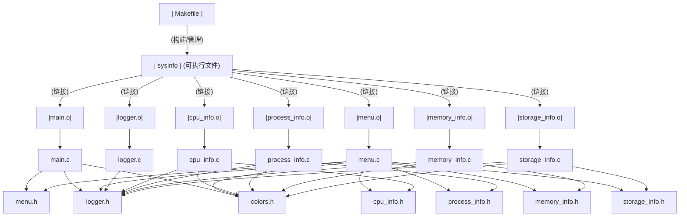

# 实验一：C语言命令行交互菜单程序

## 一、实验目的

掌握Linux系统下C语言程序的开发流程，学习使用Makefile管理多文件项目，掌握gcc编译器和gdb调试器的使用，了解Linux系统信息的获取方法（/proc文件系统），以及学习使用ANSI转义码实现终端彩色输出。

## 二、实验环境

- 操作系统：Linux
- 编译器：gcc
- 调试器：gdb
- 构建工具：make

## 三、项目结构

```
exp1/
├── Makefile              # 项目构建文件
├── include/              # 头文件目录
│   ├── colors.h         # 颜色定义头文件
│   ├── menu.h           # 菜单模块头文件
│   ├── logger.h         # 日志模块头文件
│   ├── cpu_info.h       # CPU信息模块头文件
│   ├── process_info.h   # 进程信息模块头文件
│   ├── memory_info.h    # 内存信息模块头文件
│   └── storage_info.h   # 存储设备信息模块头文件
├── src/                  # 源文件目录
│   ├── main.c           # 主程序入口
│   ├── menu.c           # 菜单模块实现
│   ├── logger.c         # 日志模块实现
│   ├── cpu_info.c       # CPU信息模块实现
│   ├── process_info.c   # 进程信息模块实现
│   ├── memory_info.c    # 内存信息模块实现
│   └── storage_info.c   # 存储设备信息模块实现
├── obj/                  # 目标文件目录（编译生成）
├── sysinfo               # 可执行文件（编译生成）
├── log.txt              # 日志文件（运行生成）
└── report1.md           # 实验报告
```

## 四、文件依赖关系图



## 五、设计思路

本程序采用模块化设计思想，将系统信息查询的各个功能分离到独立的源文件中，实现高内聚、低耦合的代码结构。整个项目分为七个功能模块：颜色定义模块（colors.h）负责定义ANSI转义码；主程序模块（main.c）作为程序入口，负责初始化和主循环控制；菜单模块（menu.c/h）负责显示彩色菜单和处理用户输入；日志模块（logger.c/h）将用户操作记录到log.txt文件；其余四个模块分别负责获取CPU、进程、内存和存储设备信息。

在系统信息获取方面，程序主要通过两种途径实现：一是直接读取Linux的/proc虚拟文件系统，如/proc/cpuinfo获取CPU信息、/proc/meminfo获取内存信息、/proc/partitions获取分区信息；二是使用popen()函数执行shell命令并捕获输出，如ps aux获取进程列表、df -h获取磁盘使用情况、free -h获取内存使用统计。这种组合方式既能获取底层硬件信息，又能得到格式化的统计数据。

为增强用户体验，程序使用ANSI转义码实现终端彩色输出。菜单边框使用青色，选项字母使用红色突出显示，标题使用黄色，信息内容根据类型使用绿色或白色。特别地，存储设备模块根据磁盘使用率动态着色：低于70%显示绿色表示正常，70%-90%显示黄色作为警告，超过90%显示红色表示危险，使用户能够直观地识别磁盘空间状态。

程序流程为：启动后首先显示欢迎界面并初始化日志系统，然后进入主循环显示菜单、获取用户输入、记录日志并执行相应功能，直到用户选择退出。

## 六、编译和执行

```bash
cd exp1
make        # 编译项目
make run    # 运行程序
make debug  # 使用gdb调试
make clean  # 清理编译文件
```

## 七、执行结果

### 7.1 欢迎界面

```
╔════════════════════════════════════════════════════════════╗
║                  Linux 系统信息查询工具                    ║
║                  System Information Tool                   ║
╚════════════════════════════════════════════════════════════╝

✓ 日志系统初始化成功
```

### 7.2 主菜单

```
------------------
C		交互菜单
------------------
A:查看CPU硬件信息
B:查看进程运行信息
C:查看内存硬件信息、内存使用信息
D:查看存储设备硬件信息、存储设备使用信息
E:退出
------------------
请输入选项: 
```

### 7.3 CPU信息显示

```
>>> 查看CPU硬件信息 <<<

┌─────────────────────────────────────┐
│          CPU硬件信息                │
└─────────────────────────────────────┘
● processor	: 0
● vendor_id	: GenuineIntel
● model name	: Intel(R) Core(TM) i7-10700 CPU @ 2.90GHz
● cpu MHz	: 2904.000
● cache size	: 16384 KB
● cpu cores	: 8

★ 总处理器数量: 8
```

### 7.4 存储设备信息（带使用率着色）

```
┌─────────────────────────────────────┐
│        存储设备使用信息             │
└─────────────────────────────────────┘
★ 磁盘使用情况 (df -h):
Filesystem      Size  Used Avail Use% Mounted on
/dev/sda1       100G   45G   55G  45% /          (绿色)
/dev/sda2        50G   40G   10G  80% /home      (黄色)
/dev/sda3        20G   19G    1G  95% /var       (红色)

图例: ■ 正常(<70%) ■ 警告(70-90%) ■ 危险(>90%)
```

## 八、总结

本实验完成了一个基于C语言的命令行交互菜单程序，实现了模块化设计、Makefile自动化编译、系统信息获取、日志记录和彩色界面显示等功能。通过本实验，掌握了Linux环境下C程序开发的完整流程，包括多文件项目管理、Makefile编写、系统编程接口使用、终端颜色控制等技能。


```text
                                       Makefile
                                          ↓ (构建/管理)
                                    sysinfo (可执行文件)
                                          ↓ (链接)
  ┌───────┬────────┬─────────┬────────────┬──────────────┬──────────────┐
main.o  menu.o  logger.o  cpu_info.o  process_info.o  memory_info.o  storage_info.o
  ↓       ↓       ↓          ↓            ↓              ↓              ↓
main.c  menu.c  logger.c  cpu_info.c  process_info.c  memory_info.c  storage_info.c
  ↓       ↓       ↓          ↓            ↓              ↓              ↓
main.h  menu.h  logger.h  cpu_info.h  process_info.h  memory_info.h  storage_info.h
 ```